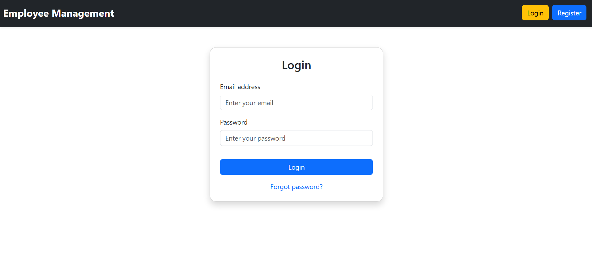
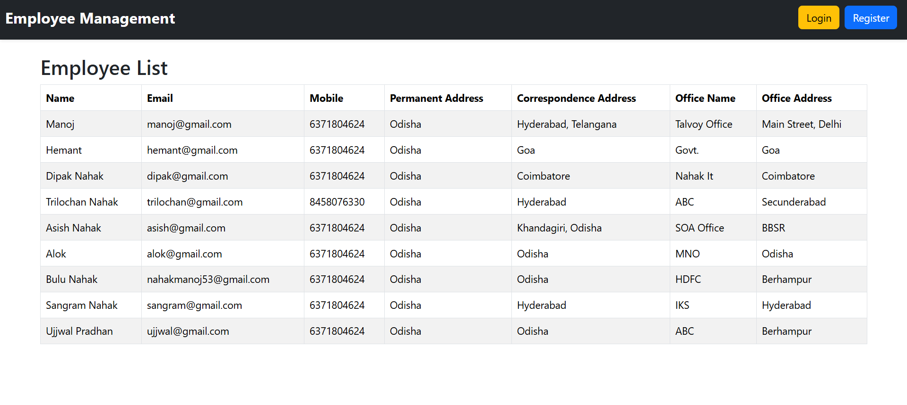
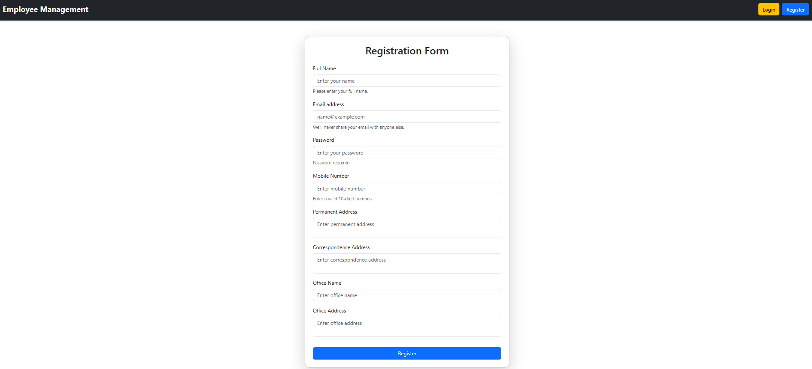
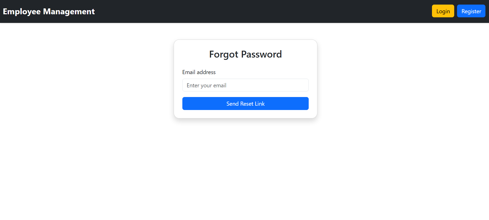
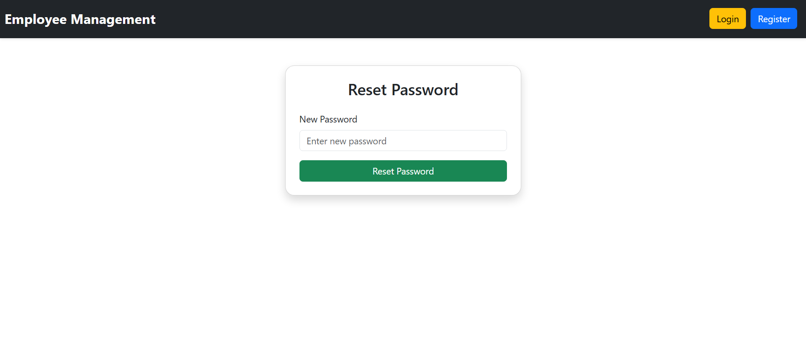
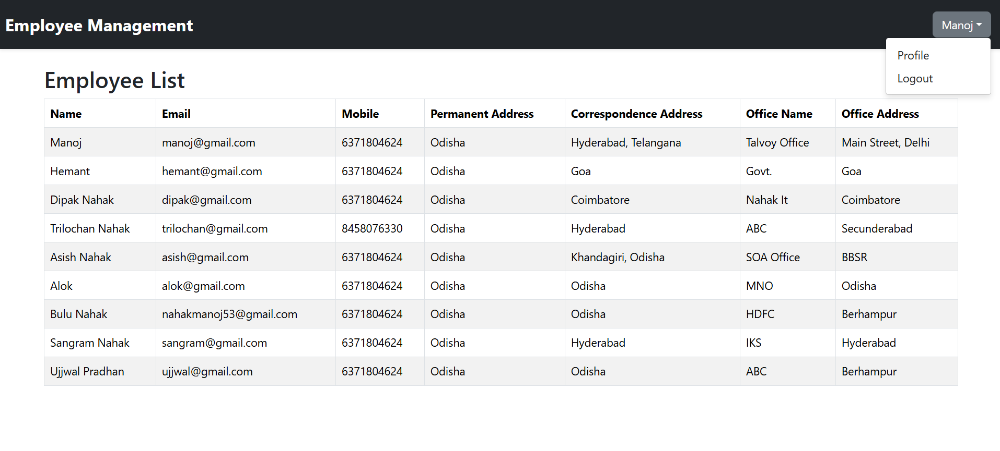
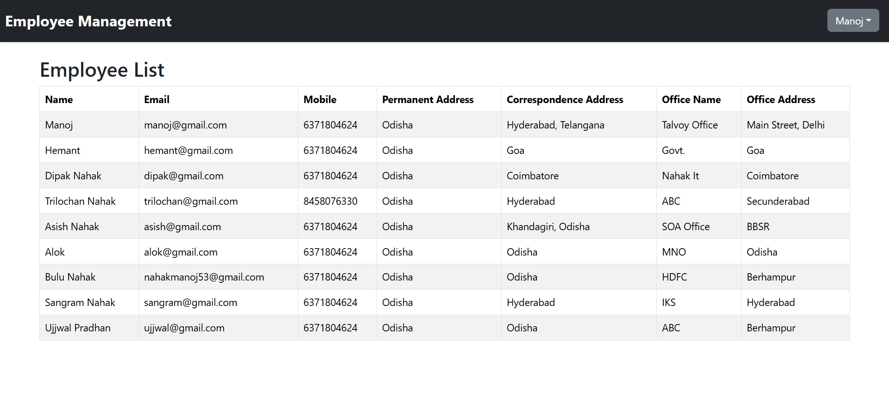

# Employee Management System

A full-stack Employee Management System built with **Spring Boot** (backend) and **React** (frontend).  
This application allows users to register, login, and manage employee details including addresses and office information.

# About Employee Management System

- Employee can register and after register their details excluding password will be display on home page.
- Employee also can login using email and password for some extra features like update their profile.
- If employee forgot their password they can also reset the password.
- There is logout options also there, and if employee is not loggedin still they see all employee details but not update any employee details.
- I also add Session for secure this application.
- I designed this with a Beautiful Navbar and display all employees with a table format.

## Project Overview

- **Backend:** Spring Boot REST API with MySQL database
- **Frontend:** React.js with form validations and axios for API calls
- **Features:**
  - User registration and login
  - Employee profile management
  - Address management (permanent, correspondence, office)
  - Secure connection to database using environment variables
- **Tools & Technologies:**
  - Java, Spring Boot, Hibernate, MySQL
  - React, Axios, Bootstrap for UI
  - Git for version control

---

## Getting Started

### Prerequisites

- Java JDK 17 or higher
- Maven
- Node.js & npm
- MySQL Server

### Backend Setup

1. Clone the repository:

   git clone https://github.com/Manojnahak7/employee-management-system.git
   cd employee-management-system/backend

2. Set up environment variables (recommended) for database credentials:

Open a new PowerShell window and run:

setx DB_URL "jdbc:mysql://localhost:3306/emp_management"
setx DB_USERNAME "your_mysql_username"
setx DB_PASSWORD "your_mysql_password"

3. Build and run the backend server:

mvn clean install
mvn spring-boot:run

## Check the APIs (In Postman or Hoppscotch)

- Register (POST) -> http://localhost:9090/api/auth/register
- Login (POST) -> http://localhost:9090/api/auth/login
- All Employees (GET) -> http://localhost:9090/api/employees
- Update Employees (PUT) -> http://localhost:9090/api/employees/me
- Forgot Password (POST) -> http://localhost:9090/api/auth/forgot-password

## Frontend Setup

1. Open a new terminal and navigate to the frontend directory:

cd ../frontend

2. Install the dependencies:

npm install

3. Start the development server:

npm run dev

4. Visit the app in your browser at:

http://localhost:5173 (or the port Vite shows)

## Screenshots

=======

# Employee Management System

A full-stack Employee Management System built with **Spring Boot** (backend) and **React** (frontend).  
This application allows users to register, login, and manage employee details including addresses and office information.

# About Employee Management System

- Employee can register and after register their details excluding password will be display on home page.
- Employee also can login using email and password for some extra features like update their profile.
- If employee forgot their password they can also reset the password.
- There is logout options also there, and if employee is not loggedin still they see all employee details but not update any employee details.
- I also add Session for secure this application.
- I designed this with a Beautiful Navbar and display all employees with a table format.

## Project Overview

- **Backend:** Spring Boot REST API with MySQL database
- **Frontend:** React.js with form validations and axios for API calls
- **Features:**
  - User registration and login
  - Employee profile management
  - Address management (permanent, correspondence, office)
  - Secure connection to database using environment variables
- **Tools & Technologies:**
  - Java, Spring Boot, Hibernate, MySQL
  - React, Axios, Bootstrap for UI
  - Git for version control

---

## Getting Started

### Prerequisites

- Java JDK 17 or higher
- Maven
- Node.js & npm
- MySQL Server

### Backend Setup

1. Clone the repository:

   git clone https://github.com/Manojnahak7/employee-management-system.git
   cd employee-management-system/backend

2. Set up environment variables (recommended) for database credentials:

Open a new PowerShell window and run:

setx DB_URL "jdbc:mysql://localhost:3306/emp_management"
setx DB_USERNAME "your_mysql_username"
setx DB_PASSWORD "your_mysql_password"

3. Build and run the backend server:

mvn clean install
mvn spring-boot:run

## Check the APIs (In Postman or Hoppscotch)

- Register (POST) -> http://localhost:9090/api/auth/register
- Login (POST) -> http://localhost:9090/api/auth/login
- All Employees (GET) -> http://localhost:9090/api/employees
- Update Employees (PUT) -> http://localhost:9090/api/employees/me
- Forgot Password (POST) -> http://localhost:9090/api/auth/forgot-password

## Frontend Setup

1. Open a new terminal and navigate to the frontend directory:

cd ../frontend

2. Install the dependencies:

npm install

3. Start the development server:

npm run dev

4. Visit the app in your browser at:

http://localhost:5173 (or the port Vite shows)

## Screenshots

